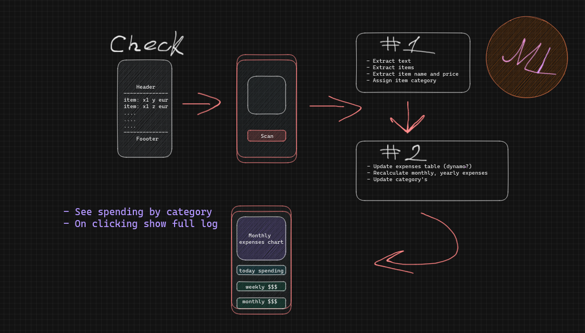

# Receipt reader
## About 🔍
Mobile app to read receipt data and calculate expenses.

## Tech stack :computer:
| Technology                   | Description                                |
| ---------------------------- | ------------------------------------------ |
| `Expo`                       | Mobile app development framework           |
| `Rocket`                     | Api development framework written in Rust  |
| `Next.js`                    | Serverside web development framework       |
| `Dynamo DB`                  | Storage solution?                          |

## Running and Setup 🛠️

| Script                       | Description                           |
| ---------------------------- | ------------------------------------- |
| `todo`                       | library what does..                   |

